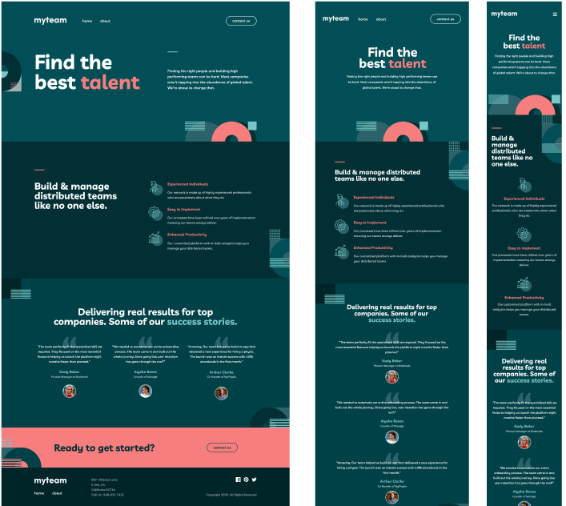
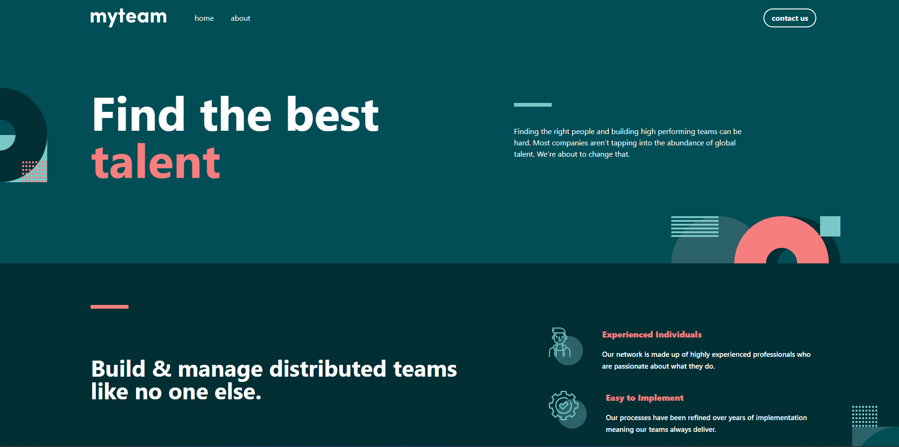

# MyTeam Multi-page Website



This is a solution to the [myteam multi-page website challenge on Frontend Mentor](https://www.frontendmentor.io/challenges/myteam-multipage-website-mxl5POn7). Frontend Mentor challenges help you improve your coding skills by building realistic projects.

## Table of Contents

- [MyTeam Multi-page Website](#myteam-multi-page-website)
  - [Table of Contents](#table-of-contents)
  - [Overview](#overview)
    - [The Challenge](#the-challenge)
    - [Screenshot](#screenshot)
    - [Links](#links)
  - [My Process](#my-process)
    - [Built With](#built-with)
    - [What I Learned](#what-i-learned)

## Overview

### The Challenge

Users should be able to:

- View the optimal layout for the interface depending on their device's screen size (Mobile, Tablet, Desktop).
- See hover and focus states for all interactive elements on the page.
- Navigate between the Homepage, About, and Contact pages.
- **About Page:** See the correct content for each team member when the `+` icon is clicked (toggle state).
- **Contact Page:** Receive an error message when the contact form is submitted if:
  - The Name, Email Address, or Message fields are empty (Message: _"This field is required"_).
  - The Email Address is not formatted correctly (Message: _"Please use a valid email address"_).

### Screenshot

**Desktop View**



**Mobile View**


### Links

- **Live Site URL:** https://aouintihouari.github.io/myteam-multi-page-website/

## My Process

### Built With

- **React** - JS Library
- **React Router** - For multi-page navigation
- **React Hook Form** - For form handling and validation
- **Tailwind CSS** - For utility-first styling and responsive design
- **Vite** - Frontend tooling
- Mobile-first workflow

### What I Learned

This project was a great opportunity to practice managing complex layouts and form states.

**1. Managing State with React Hook Form:**
I used `react-hook-form` to handle the contact form validation. It made handling error states and custom messages much cleaner than standard controlled components.

```jsx
<input
  {...register("email", {
    required: true,
    pattern: /^[A-Z0-9._%+-]+@[A-Z0-9.-]+\.[A-Z]{2,}$/i,
  })}
/>;
{
  errors.email && (
    <span>
      {errors.email.type === "pattern"
        ? "Please use a valid email address"
        : "This field is required"}
    </span>
  );
}
```
